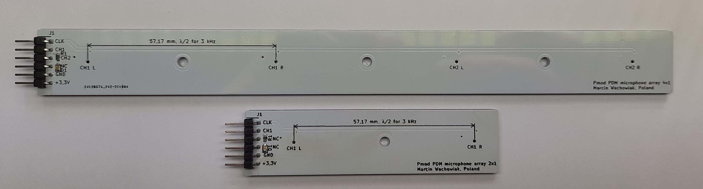
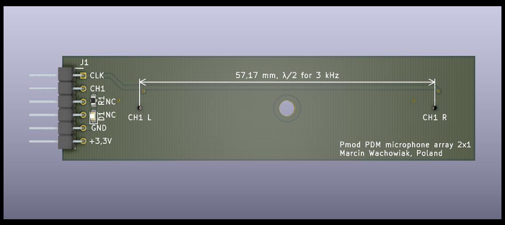
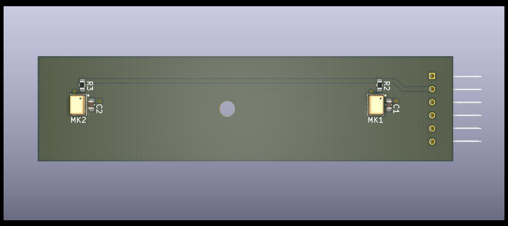
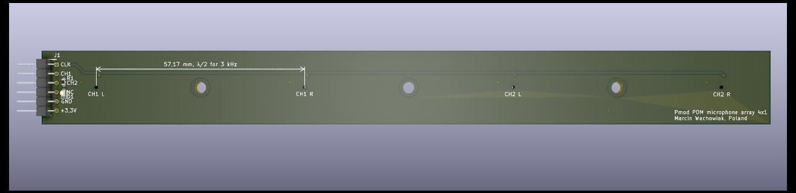
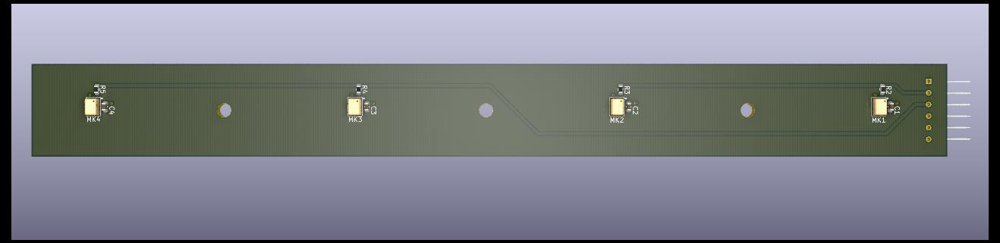
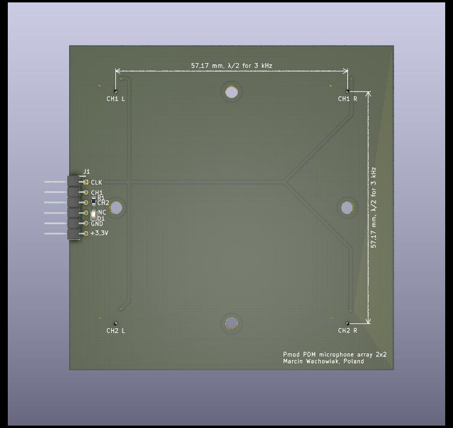
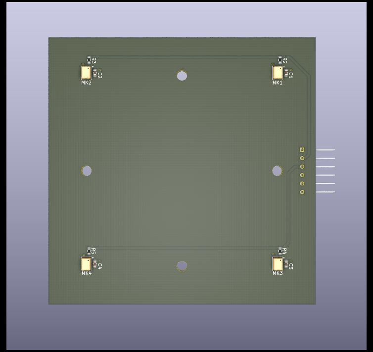

# Pmod PDM microphone array

Pmod module with multiple PDM microphones to enable array audio signal processing. Microphones are arranged in a linear array with a spacing of λ/2 at 3 kHz. The Pmod interface enables easy and straightforward evaluation with popular FPGA development boards. Used IM69D130 microphones have matched phase response (±2°) and small sensitivity tolerance (±1dB).

 

  - **Manufactured prototypes**
  
    

 **Available configurations**:

  - **2x1**

    
    

  - **4x1**
    
    
    

  - **2x2**

    
    

